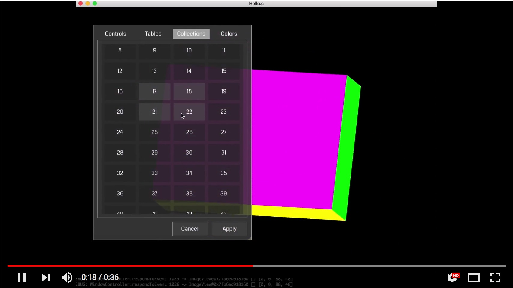
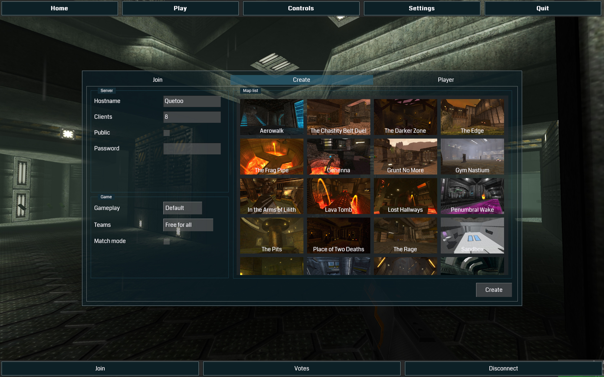
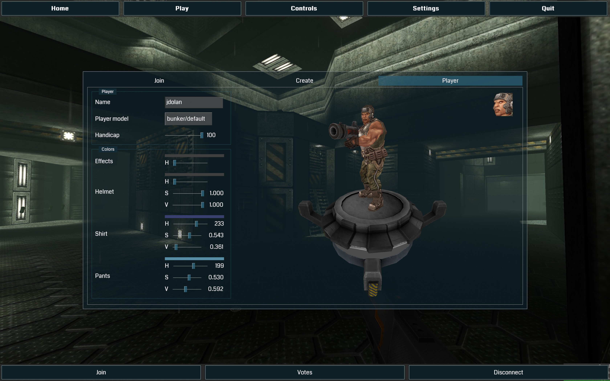

[](http://ci.quetoo.org/job/ObjectivelyMVC-Linux-x86_64/)
[](https://opensource.org/licenses/Zlib)


ObjectivelyMVC
===

Object oriented MVC framework for OpenGL, SDL2 and GNU C
---

ObjectivelyMVC is a cross-platform user interface and interaction framework for [SDL2](http://www.libsdl.org) inspired by Apple's [AppKit](https://developer.apple.com/reference/appkit). It is geared towards building high-quality, modern looking user interfaces within [OpenGL](http://www.opengl.org/) video games that are already using SDL2. It is built on [Objectively](https://github.com/jdolan/Objectively), written in [GNU C](http://www.gnu.org/software/gnu-c-manual/), and requires `gcc` or `clang`.
 
Features
---

### Object oriented Model-View-Controller implementation in C

ObjectivelyMVC is built on [Objectively](https://github.com/jdolan/Objectively), an ultra-lightweight object oriented framework for [GNU C](http://www.gnu.org/software/gnu-c-manual/). ObjectivelyMVC delivers the elegance of OO / MVC without imposing C++ on your project. If you *are* using C++ or Objective-C, ObjectivelyMVC is perfectly happy alongside those, too.

```c
WindowController *windowController = $(alloc(WindowController), initWithWindow, window);
```

### Easily embeddable in any SDL2 / OpenGL application

ObjectivelyMVC is purpose-built for video games. Unlike Gtk+, Qt, wxWidgets, FLTK, ..ObjectivelyMVC **does not hijack the main loop**. ObjectivelyMVC does not create a window, manage an OpenGL context, or originate events. Your game already does that, because it has to. Like your mother, ObjectivelyMVC only asks that you give it a call once in a while. That's it.

```c
$(windowController, respondToEvent, &event);
...
$(windowController, render);
```

### Beautiful 4K-ready fonts

ObjectivelyMVC uses [SDL_ttf](https://www.libsdl.org/projects/SDL_ttf/) to render TrueType fonts. It also automatically detects High-DPI (Retina, 4K) displays, and scales fonts accordingly. The result is crisp, beautiful vector-based fonts that look native, because they are.

```c
Data *data = $$(Data, dataWithContentsOfFile, "Verdana.ttf");
...
$$(Font, cacheFont, data, "Verdana");
...
Font *verdana = $$(Font, cachedFont, "Verdana", 24, FontStyleRegular); // will render at 48pt on Retina displays
```

### Full suite of Views and Controls

ObjectivelyMVC provides a robust set of containers, views and controls. Stack and arrange components with `Box`, `Panel` and `StackView`. Add `Buttons`, `Checkboxes`, `Selects`, `Sliders`, editable `TextViews` and more by simply instantiating them. Display tabular data or a thumbnail gallery with `TableView` and `CollectionView`. Split complex interfaces into multiple tabs with `TabView` and `TabViewController`. Bind `Actions` to `SDL_Event` types, or use the specialized _delegate_ callbacks for convenience.

```c
$(button, addActionForEventType, SDL_MOUSEBUTTONUP, my_callback, my_sender, my_data);
```

```c
Select *select = $(alloc(Select), initWithFrame, NULL);
...
select->delegate.didSelectOption = my_callback;
```

### Programmatic or JSON-based layout options

ObjectivelyMVC allows you to define your View hierarchy programmatically, via JSON, or using any combination of both. Programmatic layout gives you explicit control over the big picture, while JSON layout allows you to reduce boilerplate and avoid common pitfalls like memory leaks.

```json
{
	"class": "Panel",
	"style": {
		"top": 50,
		"left": 50
	},
	"contentView": {
		"subviews": [{
			"class": "Input",
			"control": {
				"class": "Checkbox",
				"identifier": "checkbox"
			},
			"label": {
				"text": "This is a checkbox:"
			}
		}]
	}
}
```

### Fully themable via Cascading Stylesheets

ObjectivelyMVC uses a custom CSS3 dialect to manage all aspects of its presentation. Nothing about the look and feel of ObjectivelyMVC is hard-coded, and authoring and attaching new `Stylesheets` is trivial and straightforward.

```css
/* MyView.css */

Box {
	border-color: #1e4e62;
}

Panel {
	background-color: #08151aaa;
}

.columns {
	autoresizing-mask: contain | width;
	axis: horizontal;
	distribution: fill;
}

.columns > .column {
	autoresizing-mask: contain | height;
	distribution: fill;
	width: 384;
}
```

### Simple, flexible resource loading

ObjectivelyMVC makes loading `Fonts`, `Images`, `Stylesheets`, and `Views` painless. For direct filesystem access, add directories to its search path with `$$(Resource, addResourcePath, "/my/path")`. To search your game's filesystem abstraction, implement a custom `ResourceProvider` function, and register it:

```c
static Data *resourceProvider(const char *name) {
	uint8_t *bytes;

	const ssize_t length = read_file_from_gamefs(name, &bytes);

	return length != -1 ? $$(Data, dataWithBytes, bytes, length) : NULL;
}

// ...

$$(Resource, setProvider, resourceProvider);
```

Examples
---

### HelloViewController
An example application that creates a Window, enters its main loop and draws a scene before rendering a simple menu. This example uses JSON layout.

[](https://www.youtube.com/watch?v=Rm_mOr3gP5k)

 * [Hello.c](Examples/Hello.c) - The application source code
 * [HelloViewController.h](Examples/HelloViewController.h) - The `HelloViewController` header.
 * [HelloViewController.c](Examples/HelloViewController.c) - The `HelloViewController` source code.
 * [HelloViewController.json](Examples/HelloViewController.json) - The `HelloViewController` JSON layout. 


### Quetoo
[Quetoo](https://github.com/jdolan/quetoo) is an open source FPS based on [idTech2](https://en.wikipedia.org/wiki/Quake_II_engine). Quetoo uses ObjectivelyMVC for its in-game user interface:





Installation
---

See [INSTALL.md](INSTALL.md) for installation and linking instructions.

API documentation
---
 
The API documentation can be [browsed online](http://jaydolan.com/projects/ObjectivelyMVC) or generated with [Doxygen](http://www.doxygen.org) by running `make html`.
